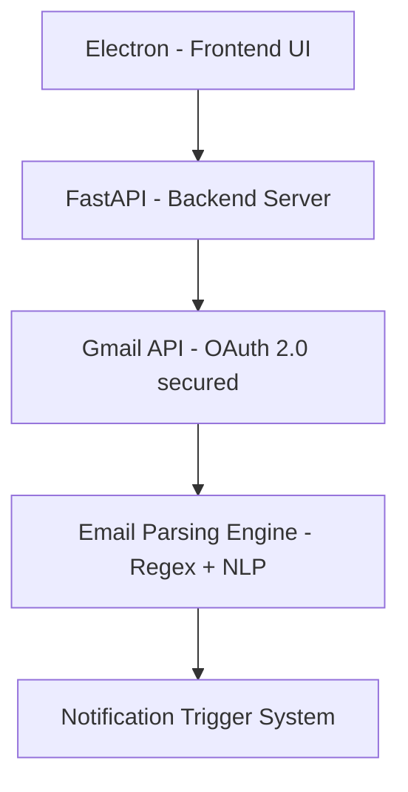

# Gmail Meeting Alarm

AI-powered desktop application that scans Gmail inbox in real-time, extracts meeting details using NLP + regex parsing, and triggers native desktop alerts so you never miss a meeting.

---

## Why I Built This

I wanted a system that automatically detects meeting details from emails instead of manually checking Gmail.
This project helped me learn:

- Gmail API integration

- OAuth 2.0 authentication flow

- Backend–Frontend communication (FastAPI + Electron)

- NLP + regex-based data extraction

- Desktop notification systems

---

## Architecture

## Tech Stack
- Frontend
  - Electron
  - HTML/CSS
  - JavaScript
- Backend
  - Python
  - FastAPI
  - Gmail API
  - OAuth 2.0
- Processing
  - Regex based time/date extraction
  - Meeting link detection
  - Sender filtering logic
 

# Features 

- OAuth-secured Gmail integration
- Intelligent meeting detection
- Sender whitelisting
- Configurable scan intervals
- Native OS notifications
- One-click email + meeting link access

---

## Key Technical Challenges Solved
- Implemented OAuth 2.0 desktop authentication flow
- Designed polling system for real-time scanning
- Extracted structured meeting data from unstructured email content
- Synced Electron frontend with FastAPI backend

---

# Installation 

Clone the repository:
~~~
git clone https://github.com/Parvv04/gmail-meeting-alarm.git
cd gmail-meeting-alarm
~~~

Install required Python packages:
~~~
pip install -r requirements.txt
~~~

Install Electron dependencies:
~~~
npm install
~~~
browser.
- On Linux, ensure `xdg-utils` is installed (usually by default) and at least one browser (e.g., Firefox, Chromium).

---

# Configuration ⚙️

You can modify these parameters in the UI or in `src/config.json`:
- Allowed sender email addresses
- Scan interval (minutes)
- Alert before meeting (minutes)
- Meeting keywords

---

# Troubleshooting

- **No notifications?**
  - Check your system's notification settings.
  - Ensure emails contain the keywords set in the UI.
- **Links not opening?**
  - Make sure you have a browser installed and set as default.
  - On Linux, install `xdg-utils` and a browser (e.g., `sudo apt install firefox`).
- **Backend not reachable?**
  - Make sure `python3 src/main.py` is running and accessible at `http://127.0.0.1:8000`.

---

## Security 🔒
- Your credentials are stored locally and never transmitted
- The app only requests minimum required permissions (read-only for Gmail)
- You can revoke access anytime at Google Account Security

---
