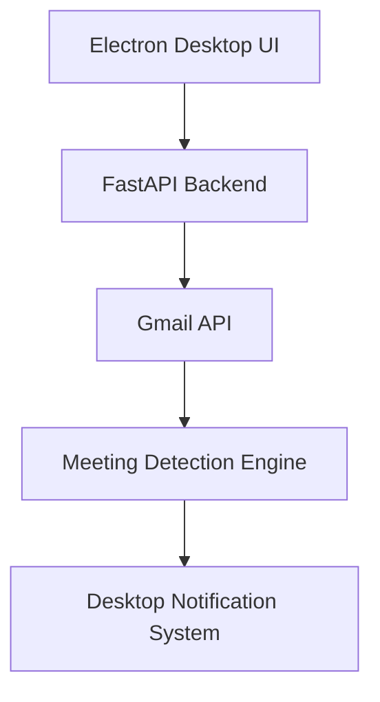

# MailMinder

AI-powered desktop application that monitors Gmail inboxes, detects meeting-related emails, extracts structured meeting information, and sends real-time desktop notifications.

---

## Demo

Watch the project demo:

https://youtu.be/yEPV_UyySls

---

## Features

* Gmail API integration
* OAuth 2.0 authentication
* Multi-account support
* Meeting detection using NLP and regex
* Meeting link extraction
* Sender whitelisting
* Configurable scan intervals
* Native desktop notifications
* Electron-based desktop interface

---

## Tech Stack

### Frontend

* Electron
* HTML
* CSS
* JavaScript

### Backend

* Python
* FastAPI
* Gmail API
* OAuth 2.0

### Processing

* NLP-based meeting detection
* Regex-based date/time extraction
* Meeting link extraction
* Sender filtering

---

## System Architecture


```mermaid
flowchart TD
    A[Electron Desktop UI]
    B[FastAPI Backend]
    C[Gmail API]
    D[Meeting Detection Engine]
    E[Desktop Notification System]

    A --> B
    B --> C
    C --> D
    D --> E
```

---

## Installation

### 1. Clone Repository

```bash
git clone https://github.com/Parvv04/gmail-meeting-alarm.git
cd gmail-meeting-alarm
```

### 2. Install Python Dependencies

```bash
pip install -r requirements.txt
```

### 3. Install Electron Dependencies

```bash
npm install
```

---

## Google OAuth Setup

### Create OAuth Credentials

1. Open Google Cloud Console.
2. Create a project.
3. Enable Gmail API.
4. Configure OAuth Consent Screen.
5. Create OAuth Client ID.
6. Choose **Web Application**.

### Add Redirect URI

```text
http://localhost:5000/api/oauth/callback
```

### Download Credentials

Download the OAuth credentials JSON file and rename it:

```text
credentials.json
```

Place it in the project root directory.

---

## Running the Application

### Start Backend

```bash
python src/main.py
```

Backend should start at:

```text
http://localhost:5000
```

### Start Electron App

Open a second terminal:

```bash
npm start
```

---

## First-Time Authentication

1. Click "Add Account"
2. Enter Gmail address
3. Sign in with Google
4. Grant Gmail read-only permission
5. Authentication token will be stored locally

---

## Configuration

Available settings:

* Allowed sender email addresses
* Scan interval
* Alert time before meeting
* Meeting keywords

Configuration can be changed directly through the application UI.

---

## Security

* Uses Gmail read-only scope
* Credentials remain on the local device
* No email content is transmitted externally
* Access can be revoked through Google Account Security settings

---

## Future Improvements

* Google Calendar integration
* Meeting analytics dashboard
* Cross-platform installer packages
* AI-powered meeting categorization
* Cloud synchronization

```
